# Modelo Entidad-Relación — YerbatApp

Fuente de verdad: [`database/prisma/schema.prisma`](../database/prisma/schema.prisma). Este documento es un mapa de navegación, no una copia — ante cualquier duda sobre un campo puntual, revisar el schema.

## Diagrama general

```mermaid
erDiagram
  TENANT ||--o{ USER : tiene
  TENANT ||--o{ CAMPO : tiene
  TENANT ||--o{ CLIENTE : tiene
  TENANT ||--o{ PROVEEDOR : tiene
  TENANT ||--o{ FACTURA : tiene
  TENANT ||--o{ TAREA : tiene
  TENANT ||--o{ CUENTA_FINANCIERA : tiene
  TENANT ||--o{ NOTIFICACION : tiene
  TENANT ||--o| EMPRESA_CONFIG : tiene

  USER ||--o{ REFRESH_TOKEN : posee
  USER ||--o{ PASSWORD_RESET_TOKEN : solicita
  USER ||--o{ LOGIN_HISTORY : genera
  USER ||--o{ ACTIVITY_LOG : genera
  USER ||--o{ CAMPO_NOTA : redacta

  CAMPO ||--o{ CULTIVO : contiene
  CAMPO ||--o{ CAMPO_NOTA : tiene
  CAMPO ||--o{ CAMPO_DOCUMENTO : tiene
  CAMPO ||--o{ CAMPO_FOTO : tiene
  CAMPO ||--o{ TAREA : programa
  CAMPO ||--o{ APLICACION_INSUMO : recibe
  CAMPO ||--o{ RENDIMIENTO : genera

  CULTIVO ||--o{ CULTIVO_HISTORIAL : registra
  CULTIVO ||--o{ RENDIMIENTO : genera
  CULTIVO ||--o{ APLICACION_INSUMO : recibe
  CULTIVO ||--o{ TAREA : afecta

  CAMPANIA ||--o{ RENDIMIENTO : agrupa

  PROVEEDOR ||--o{ PRODUCTO : vende
  PROVEEDOR ||--o{ APLICACION_INSUMO : provee
  PROVEEDOR ||--o{ FACTURA : emite
  PROVEEDOR ||--o{ MOVIMIENTO_CUENTA_CORRIENTE : mueve
  PRODUCTO ||--o{ APLICACION_INSUMO : usado_en

  CUENTA_FINANCIERA ||--o{ MOVIMIENTO_FINANCIERO : registra
  CATEGORIA_FINANCIERA ||--o{ MOVIMIENTO_FINANCIERO : clasifica
  CENTRO_COSTO ||--o{ MOVIMIENTO_FINANCIERO : imputa
  FACTURA ||--o{ MOVIMIENTO_FINANCIERO : origina
  FACTURA ||--o{ MOVIMIENTO_CUENTA_CORRIENTE : origina

  CLIENTE ||--o{ FACTURA : recibe
  CLIENTE ||--o{ MOVIMIENTO_CUENTA_CORRIENTE : mueve

  CAMPO_NOTA ||--o{ CAMPO_NOTA_ADJUNTO : tiene
  TAREA ||--o{ TAREA_ADJUNTO : tiene
  FACTURA ||--o{ FACTURA_ADJUNTO : tiene
  MOVIMIENTO_FINANCIERO ||--o{ MOVIMIENTO_ADJUNTO : tiene
```

## Grupos de entidades

| Grupo | Entidades | Estado de implementación (API + UI) |
|---|---|---|
| Core / Tenancy / Auth | `Tenant`, `User`, `RefreshToken`, `PasswordResetToken`, `LoginHistory`, `ActivityLog` | ✅ Completo |
| Campos / Cultivos | `Campo`, `CampoNota`, `CampoNotaAdjunto`, `CampoDocumento`, `CampoFoto`, `Cultivo`, `CultivoHistorial` | ✅ Completo |
| Rendimientos | `Campania`, `Rendimiento` | ✅ Completo |
| Insumos | `Proveedor`, `Producto`, `AplicacionInsumo` | ✅ Completo |
| Tareas | `Tarea`, `TareaAdjunto` | ✅ Completo |
| Finanzas | `CuentaFinanciera`, `CategoriaFinanciera`, `CentroCosto`, `MovimientoFinanciero`, `MovimientoAdjunto` | ✅ Completo |
| Comercial | `Cliente`, `MovimientoCuentaCorriente` | ✅ Completo |
| Facturación | `Factura`, `FacturaAdjunto` | ✅ Completo (incluye panel de IVA calculado sobre estas tablas) |
| Notificaciones / Backups / Config | `Notificacion`, `BackupLog`, `EmpresaConfig`, `ParametroSistema` | ✅ Completo |

## Notas de diseño

- **IDs**: UUID v4 en todas las tablas (`@default(uuid())`), evita IDs secuenciales predecibles y facilita la sincronización futura con la app Android offline-first.
- **Dinero y cantidades**: `Decimal` con precisión fija (`@db.Decimal(p, s)`), nunca `Float`, para evitar errores de redondeo en cálculos financieros.
- **Adjuntos**: cada entidad que necesita adjuntos tiene su propia tabla `<Entidad>Adjunto` (en vez de una tabla polimórfica genérica), para mantener foreign keys reales y `onDelete: Cascade` correcto en Postgres.
- **Multi-tenant**: ver [`architecture.md`](architecture.md#multi-tenant).
